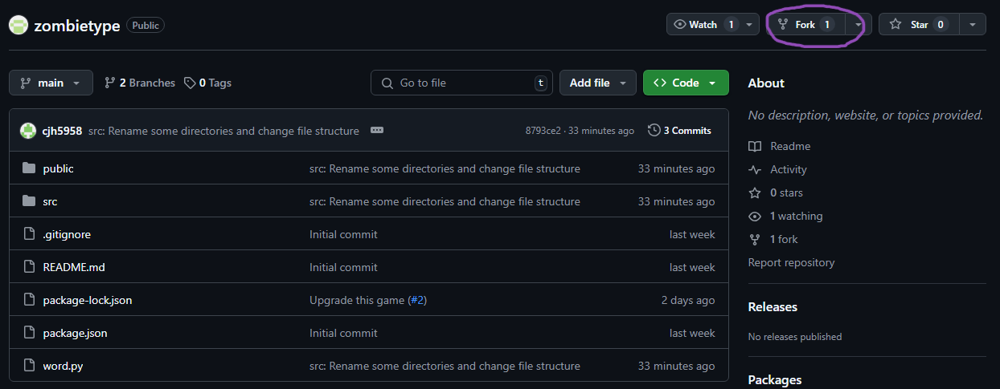

# ZombieType

專為 **智慧型語言學習系統 ( CALL )** 設計的打字遊戲

## :rocket: 如何開始
### 安裝 Node.js ( Windows 10, 11 )

1. 下載 [Node.js 官方安裝程式](https://nodejs.org/en)。
2. 選擇 **LTS (長期支援版)**，安裝時確保勾選 `Add to PATH` 選項。
3. 使用 `node -v` 以及 `npm -v` 確認環境沒問題。

### Fork 一份 Github repo 到自己的帳號
在 [**zombietype**](https://github.com/PeiLingMa/zombietype.git) 頁面中選擇 `fork` -> `create a new fork`

Github 會自動建立一份副本，複製副本的 url 並使用：
```bash
git clone <url>
```
將副本複製到本地的同名資料夾下，然後就可以開始對專案進行修改了。

### 安裝模組
複製好副本檔案後，使用以下指令安裝 **Node.js Modules**：
```bash
cd zombietype
npm install
```
### 啟動 npm-server
使用指令
```
npm start
```
開始編譯檔案，並啟用 npm-server，接著 npm 會自動開啟瀏覽器連接到 `http://localhost:3000`。

## :mag: 專案內容

### 檔案目錄結構
```
zombietype/
│  .gitignore
│  package-lock.json
│  package.json
│  README.md
│  word.py
├─assets/
│   ...
├─public/
│  │  data.json ------------------------ # 題庫
│  │  favicon.ico
│  │  index.html
│  │  logo192.png
│  │  logo512.png
│  │  manifest.json
│  │  robots.txt
│  └─sounds/
│       ...
└─src/
    │  App.test.js
    │  index.css
    │  index.js
    │  logo.svg
    │  reportWebVitals.js
    │  setupTests.js
    └─components/
        ├─ChallengeMode/
        │      ChallengeMode.js
        │      shake.css
        │      zombie1.png
        │      zombie2.png
        │      zombie3.png
        │      zombie4.png
        ├─MainMenu/
        │      App.css
        │      App.js
        │      background.png
        ├─Option/
        │      Option.js
        └─StoryMode/
                StoryMode.js
```
### TODO List


## 其他


